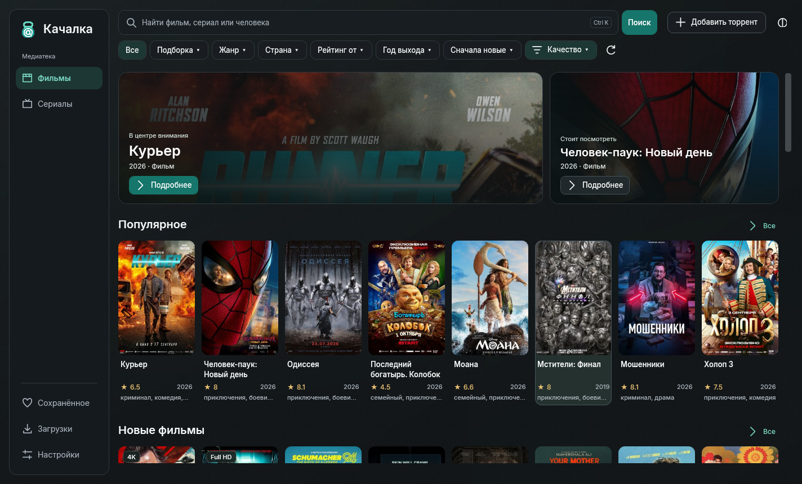
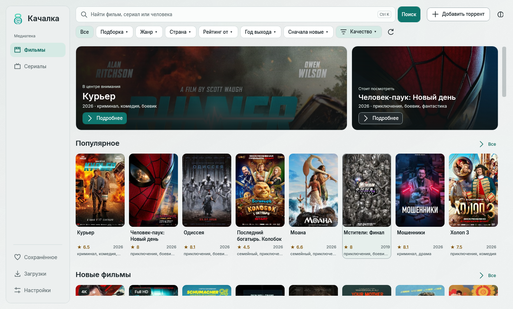
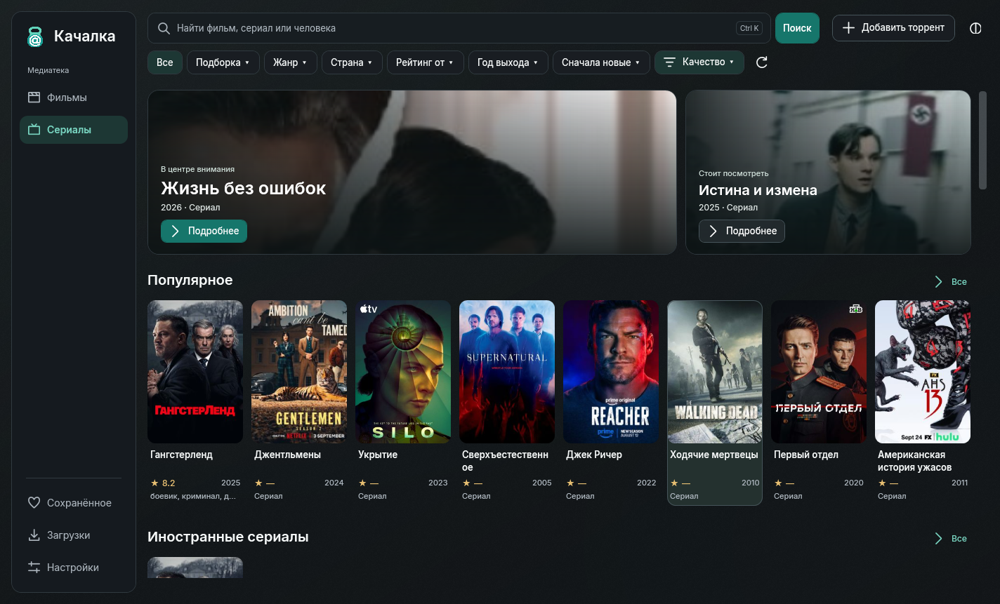
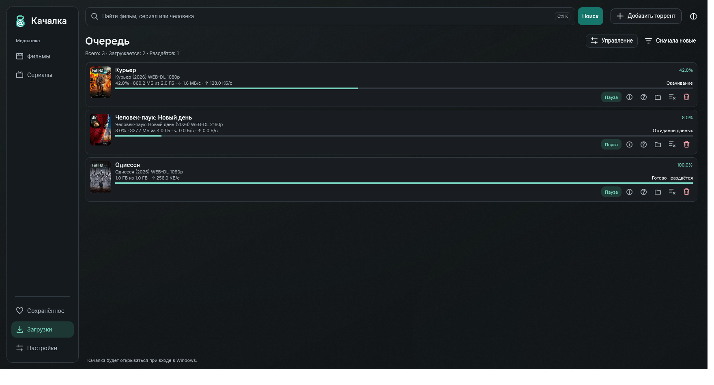

# Качалка

Приложение для Windows: каталог фильмов и сериалов, поиск раздач, загрузки через torrent и magnet. Нативный интерфейс с тёмной темой по умолчанию и светлой темой на выбор.

**[Скачать установщик 0.39.0 для Windows x64](https://github.com/peregond/ka4alka/releases/download/v0.39.0/Kachalka-Setup-0.39.0.exe)**

[Что нового](https://github.com/peregond/ka4alka/releases/tag/v0.39.0) · [Все выпуски](https://github.com/peregond/ka4alka/releases) · [Установка и возможности](distribution/README.md)

## Скриншоты 0.39.0

Каталог фильмов · тёмная тема.

Светлая тема, сериалы, загрузки и устройства в сети

### Светлая тема

### Сериалы

### Пример очереди загрузок

Демонстрационные задачи показывают обложки, прогресс, скорость и действия с файлами.

### Подтверждение связи устройств в локальной сети

Перед отправкой загрузки на другой компьютер одинаковый код подтверждается в обеих Качалках.

## Начало работы

1. Установите приложение из `.exe`. Поддерживаются Windows 10 и 11 x64; .NET включён в поставку.
2. При первом запуске выберите место для загрузок. Приложение создаст в нём папку `Ka4alka`.
3. Найдите фильм или сериал, откройте карточку и выберите раздачу.

Настройки, сохранённое и очередь сохраняются между запусками. Обновления загружаются с GitHub; неизменившиеся компоненты используются повторно.

В 0.39 появилась отправка загрузок на другой компьютер в домашней сети. Включите «Устройства в сети» на обоих компьютерах и подтвердите связь. Подробности — в [руководстве](distribution/README.md#загрузка-на-другое-устройство).

## Исходники и разработка

Актуальные исходники опубликованной версии находятся в [теге `v0.39.0`](https://github.com/peregond/ka4alka/tree/v0.39.0). Ветка `main` содержит более раннюю версию исходников и общую документацию.

Инструкции для облачной среды — [CLOUD.md](CLOUD.md). Приложение написано на C# / WPF и использует MonoTorrent. Инструкции сборки и проверок текущей версии доступны в [README релизного тега](https://github.com/peregond/ka4alka/blob/v0.39.0/README.md).
