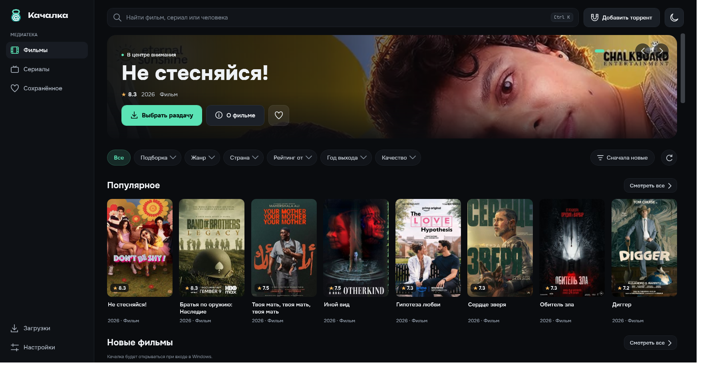
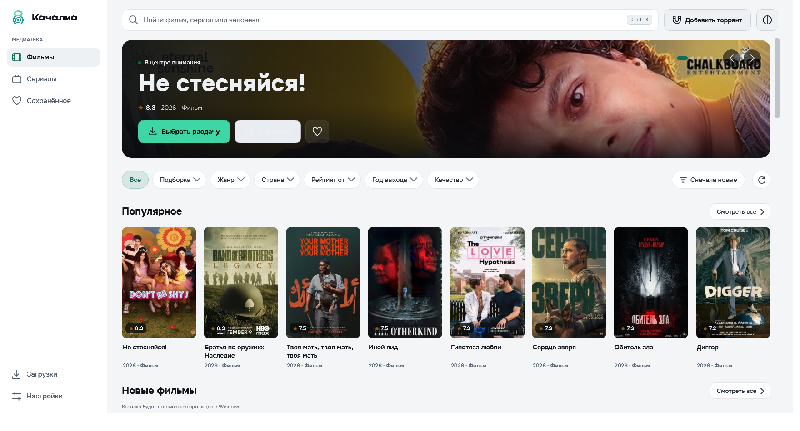
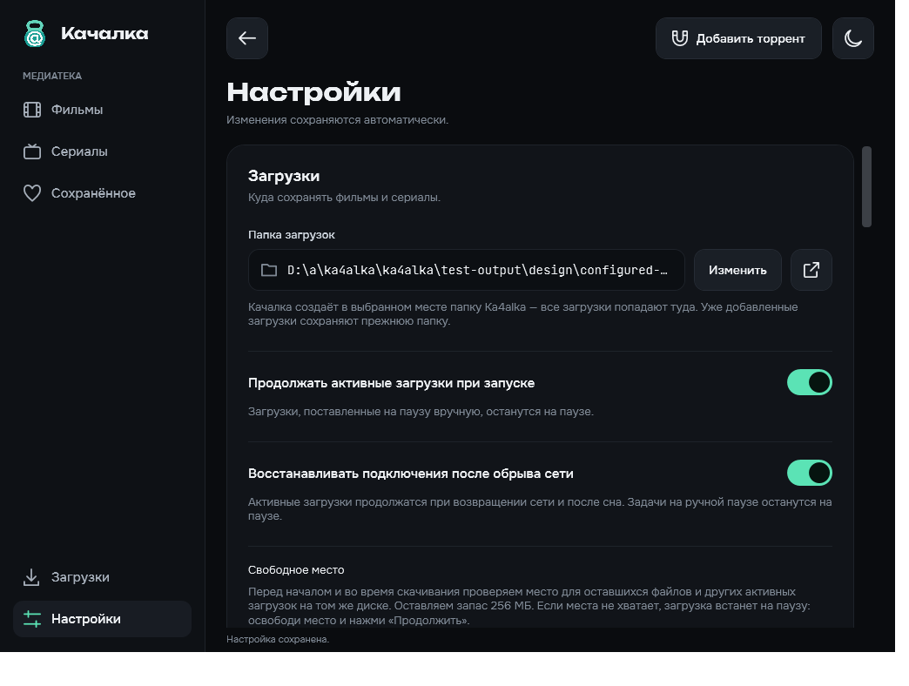
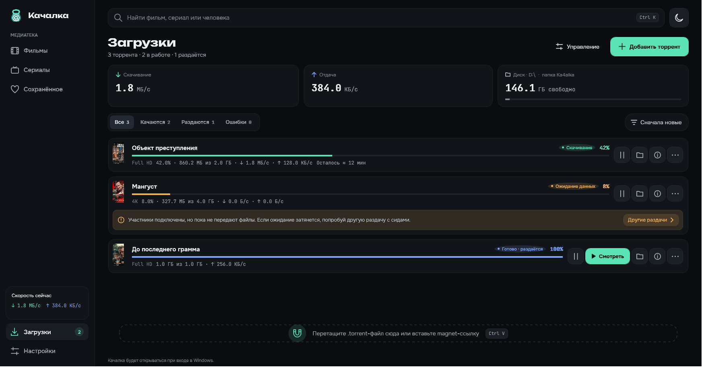
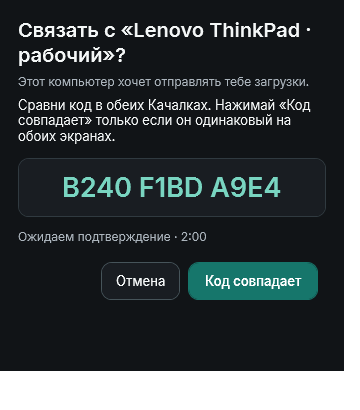

# Качалка

Нативное приложение для Windows: фильмы и сериалы с постерами, выбор раздачи и загрузка через torrent или magnet. Без Electron и встроенного браузерного движка.

**[Скачать установщик 0.40.3 для Windows x64](https://github.com/peregond/ka4alka/releases/download/v0.40.3/Kachalka-Setup-0.40.3.exe)**

[Все выпуски и изменения](https://github.com/peregond/ka4alka/releases) · [Каталог «Ка4алка Онл@йн»](https://ka4alka-online-new.peregon.chatgpt.site/)

## Скриншоты 0.40.3

Каталог фильмов · тёмная тема.

[](assets/0.40/catalog-dark.png)

<details>
<summary>Ещё скриншоты</summary>

### Светлая тема

[](assets/0.40/catalog-light.png)

### Карточка фильма

[](assets/0.40/detail-wide-dark.png)

### Настройки

[](assets/0.40/settings-dark.png)

### Пример очереди загрузок

Демонстрационные задачи показывают прогресс и доступные действия.

[](assets/0.40/downloads-dark.png)

### Подтверждение связи устройств

[](assets/0.39/lan-pairing-dark.png)

</details>

## Установка

1. Скачайте `Kachalka-Setup-0.40.3.exe` и запустите его.
2. Откройте «Качалку» через ярлык на рабочем столе или в меню «Пуск».
3. При первом запуске выберите место для загрузок. В нём создаётся папка `Ka4alka`; путь сохраняется и позже меняется в настройках.

Нужны Windows 10/11 x64 и интернет для каталога и поиска участников. .NET включён в поставку; устанавливать его отдельно не нужно. Подпись издателя пока отсутствует. Это ранняя версия приложения.

## Возможности

- Страницы по 40 фильмов или сериалов, номера после карточек и переходы назад/вперёд.
- Фильтры каталога одной строкой под поиском; единое меню качества с вариантами 4K, Full HD и HD Ready.
- Жанр, страна, минимальный рейтинг, год и сортировка; подборки «Популярное» и «Высокий рейтинг» из Zona.
- Подборки «Популярное», «Новые», «Иностранные» и «Отечественные» по стране производства; домашняя страна выбирается в настройках.
- Постеры, оценки Кинопоиска и IMDb при наличии данных, поиск фильмов и участников.
- Раздел «Сохранённое» над «Загрузками», общий для фильмов и сериалов.
- Карточка фильма с компактной панелью раздач и фотографиями участников без лишних рамок.
- Фильтры качества, озвучки, субтитров, кодека и источника; сезоны и серии для сериалов.
- Состояние поиска в разделе «Раздачи», сведения об источниках и сохранённые варианты при временной недоступности сети.
- Общий поиск фильмов и сериалов с выбором типа в результатах.
- Компактная очередь с обложками, названиями из каталога и исходными названиями раздач ниже. Запуск и пауза — текстовой кнопкой, остальные действия — иконками рядом. Новые задачи сверху; доступны другие сортировки. Общее управление загрузками/раздачами и лимиты скорости находятся в верхнем меню.
- Подробный список файлов и серий с прогрессом и поиском в светлой или тёмной теме; отдельные действия «Удалить из загрузок» и «Удалить файлы».
- Минималистичное оформление: графитовая тёмная тема по умолчанию, контрастная светлая тема и единый бирюзовый акцент. Обновлены иконка приложения и логотип; адаптивное окно, плавная прокрутка и виртуализация списков сохранены.
- Отправка выбранной раздачи на другой компьютер в локальной сети: имена устройств, автоматическое обнаружение и ручное подключение по IPv4, сопряжение с подтверждением кода на обоих устройствах. Получатель использует собственную папку загрузок; аккаунт не нужен.

## Загрузка на другое устройство

На двух компьютерах в одной домашней IPv4-сети откройте 0.40.3 и включите «Устройства в сети» в настройках. По умолчанию имя берётся из модели компьютера; его можно поменять. Найдите второй компьютер автоматически или введите его локальный IPv4-адрес, затем сравните одинаковый 12-символьный код и подтвердите сопряжение на обоих экранах.

В выбранной раздаче нажмите «Скачать на другом устройстве». После добавления задания появится подтверждение; получатель скачивает файлы в свою настроенную папку. Обе программы должны оставаться открытыми для передачи задания. Брандмауэр должен разрешать входящие подключения Качалки в частной сети; это действие доступно в настройках и отдельно запрашивает права администратора. Гостевая Wi-Fi-сеть с изоляцией клиентов может блокировать связь даже по указанному адресу.

Передача защищена TLS и привязана к подтверждённым устройствам, без учётной записи или облачного сервера. Доверенное устройство можно забыть в настройках. Функция отключена до включения пользователем.

## Обновление

Для перехода с 0.18 один раз установите текущую версию вручную. Затем приложение проверяет обновления на GitHub, скачивает их и устанавливает при выходе. В настройках указана текущая версия, доступны ручная проверка и перезапуск для обновления. Готовое обновление показывает кнопку «Обновить» под «Настройками» в левом меню. Автоматическую проверку и установку можно отключить. Настройки и очередь хранятся в `%LOCALAPPDATA%/Kachalka` и доступны новой версии.

Обновление требует `latest.json` и действительную подпись `latest.sig`; до установки проверяются SHA-256 и структура ZIP. При неудачном запуске выполняется откат к предыдущей версии. С 0.22.0 загружаются только изменившиеся компоненты; переход со старого клиента один раз использует полный пакет.

## Проверка архива

В каждом выпуске есть `SHA256SUMS.txt`. SHA-256 скачанного архива можно получить в PowerShell:

```powershell
Get-FileHash -LiteralPath .\Kachalka-win-x64.zip -Algorithm SHA256
```

Папка `licenses` в сборке содержит лицензии и уведомления используемых компонентов. В этом репозитории публикуются готовые сборки, документация и сведения о версиях.
